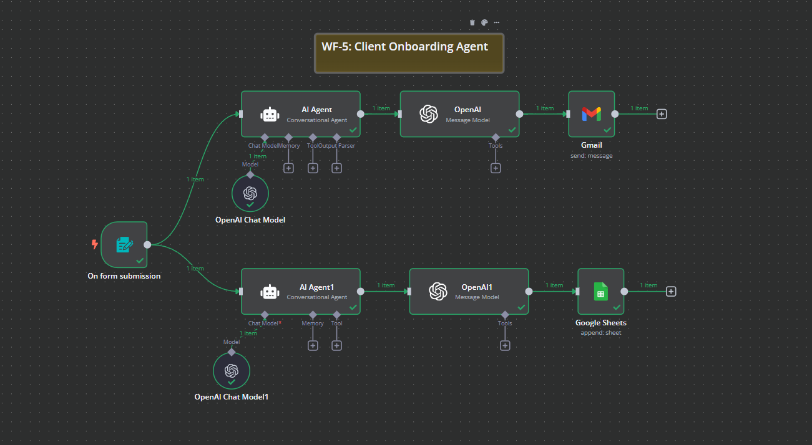

# WF-5: Client Onboarding Agent – n8n Workflow

## 📌 Overview
This **n8n workflow**, `WF-5: Client Onboarding Agent`, automates the onboarding process for new clients. It captures client details, generates a personalized welcome email, and stores client summaries for future reference.

## 🔧 Workflow Components
### 🏗️ Core Modules
1. **📝 Form Trigger** – Captures client information via a web form.
2. **🤖 AI Agent** – Generates a personalized welcome email based on client details.
3. **📧 Gmail** – Sends the customized welcome email to the client.
4. **📋 Client Summary AI Agent** – Creates a structured summary of client details.
5. **📊 Google Sheets** – Stores client summaries for reference and tracking.

## ⚙️ How It Works
1. 📝 A new client submits the onboarding form.
2. 🤖 The **AI Agent** processes the client’s details and drafts a professional welcome email.
3. 📤 The **Gmail** node sends the welcome email.
4. 📝 A second **AI Agent** generates a structured summary of the client.
5. 📊 The **Google Sheets** node stores the client summary for tracking.

## 📷 Workflow Screenshot

## 🚀 Setup Instructions
- 📥 **Import the workflow** into `n8n`.
- 🔑 **Ensure API credentials** for OpenAI, Gmail, and Google Sheets are configured.
- ✅ **Activate the workflow** to start onboarding clients.

## 📝 Notes
- ⚠️ The workflow is **inactive by default**.
- 🛠️ Customize the email templates and form fields as per business requirements.
